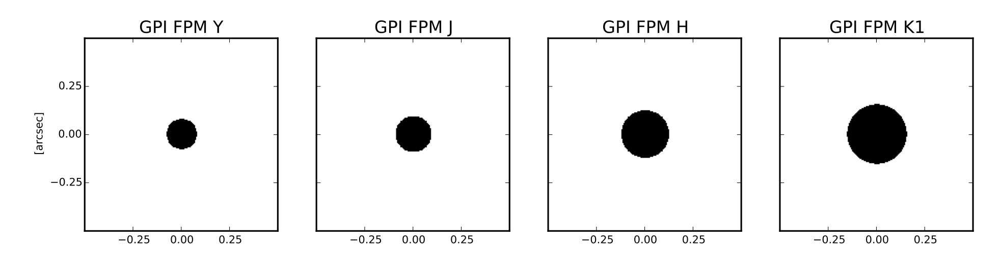

.. _reference_coronagraph:

Design of GPI Coronagraph Masks
=======================================

Overview
------------

**Coronagraph:**
The design of the apodized prolate Lyot coronagraph (APLC) is developed in 
a series of papers by Remi Soummer et al., starting with 
`Soummer et al. 2003 <http://adsabs.harvard.edu/abs/2003A%26A...397.1161S>`_ and
`2005 <http://adsabs.harvard.edu/abs/2005ApJ...618L.161S>`_. Specifically GPI implements
a set of achromatic optimized apodization functions as described in `Soummer et al. 2011 <http://adsabs.harvard.edu/abs/2011ApJ...729..144S>`_.

An APLC has optical elements in three planes:

  * An :ref:`apodizer <coronagraph_apodizer>` in a pupil plane to shape the incoming beam of starlight.
  * A :ref:`focal plane mask (FPM) <coronagraph_apodizer>` in a image plane to reject the starlight in the PSF core.
  * A :ref:`Lyot mask <coronagraph_lyotmask>` in a second pupil plane to reject the diffracted starlight that gets past the FPM.

Each GPI coronagraph consists of a matched set of apodizer+FPM+Lyot mask. 

**Masking of Nonfunctional Actuators:**

Nonfunctional actuators in the MEMS tweeter deformable mirror must be masked
out in the Lyot plane or else they will diffract additional light into the
final image.  To do this, there are opaque tabs included in the Lyot mask design.

There are four nonfunctional actuators on the MEMS DM used as
GPI's "tweeter" mirror (device serial number 080, which shows up in the Lyot
mask part names.). In a coordinate system such that the center of the primary
is located at (x,y) = (35.5, 32.5), the nonfunctional actuators are (53, 41),
(24, 49), (47, 15), and (27, 27). In addition there is a pair of adjacent
actuators that are not dead but are coupled together, at (40, 27) and (40, 28). 

**Astrometric Satellite Spot Grid:**

The Gemini South Primary Mirror
------------------------------------

The geometry of the Gemini South primary is one of the boundary conditions for GPI's coronagraph.  The pupil stop is 
the secondary mirror, M2, which is undersized relative to the primary to minimize the thermal background (and to allow 
for chopping in mid-infrared observations, though that's no longer done). In the case of Gemini South the M2 is further stopped down by an opaque mask that baffles a slight turned-down region at the outer edge of M2. Also M2 has a hole through its middle which prevents directretroreflection of thermal emission back to the instruments.

**Outer Diameter:** 7.7701 m (projected diameter of baffle on M2)

**Inner Diameter:** 1.2968 m (projected diameter of M2 inner hole)

**Secondary Supports:**
The secondary supports are only 1 cm wide, except for the one with the laser launch feed which is 1.4 cm wide. 
They are not an orthogonal cross, but rather are a pair of Vs, each 93.8 degrees wide with vertices offset from the primary center by 0.2179 m. 

Because the Gemini telescopes were optimized for the thermal infrared, the secondary supports are very thin compared to most telescopes, and have correspondingly little effect on the PSF. However we mask them out in the Lyot planes regardless. 

.. _coronagraph_apodizer:

Apodizer Details
-------------------

The GPI apodizers are fabricated using microdot printing. See `Sivaramakrishnan et al. 2009 <http://adsabs.harvard.edu/abs/2009SPIE.7440E..1CS>`_ for details of this technology and its characterization, and `Sivaramakrishnan et al. 2010 <http://adsabs.harvard.edu/abs/2010SPIE.7735E..86S>`_ for for fabrication details and images of masks. 

Name       Outer Diameter

.. _coronagraph_FPM:

Focal Plane Mask Details
-----------------------------

The focal plane masks are implemented as highly precise circular holes in mirrors. The same FPM is used for both K1 and K2.
These masks were fabricated using deep reactive ion etching in gold-coated silicon mirrors. See `Sivaramakrishnan et al. 2010 <http://adsabs.harvard.edu/abs/2010SPIE.7735E..86S>`_ for fabrication details and images of hardware.  

===========   =================   ============================
Name          Diameter (mas)       Diameter (lambda/D)
===========   =================   ============================
Y             156.2                5.6 for Y
J             184.7                5.6 for J
H             246.7                5.6 for H
K1            246.7                5.6 for K1, 5.08 for K2
===========   =================   ============================

There is also a mirror with no occulter hole, which sends the entire field of view to the IFS. THis is used for direct and NRM 
observations. For obscure historical reasons [#footnote1]_ this mask is labeled as the 'SCIENCE' position in the 

The selected focal plane mask is recorded in FITS keyword ``OCCULTER``, using variable names with Gemini-style name formatting, e.g. ``FPM_H_G6225`` instead of just ``H``. 

       Schematic of GPI focal plane masks

.. _coronagraph_lyotmask:

Lyot Mask Details
----------------------

The Lyot masks are named starting with the string '080m12'. This refers to the specific MEMS DM used for GPI (serial number #80), 
and the mask version modified in 2012. 

The below table gives the mask geometries as they appear projected (rescaled) onto the primary mirror. The actual physical parts are just under 1 cm in diameter.

=============  ================= ================== ================== ======================  =====================================
Mask Name       Outer Diam. (m)   Inner Diam. (m)   Support Width (m)   Bad Act. Mask Diam.     Notes
=============  ================= ================== ================== ======================  =====================================
080_04          7.57              2.1954                0.3195          0.677 
080m12_03       7.57              2.1954                0.24042         0.598 
080m12_03_06    7.57              2.1954                0.24042         0.835 
080m12_04       7.57              2.1954                0.3195          0.677 
080m12_04_c     7.57              2.1954                0.47767         0.598 
080m12_06       7.57              2.1954                0.47767         0.835 
080m12_06_03    7.57              2.1954                0.47767         0.835 
080m12_07       7.4118            2.3536                0.47767         0.835 
080m12_10       6.9231            2.8028                0.79401         1.15 
Blank           0                 0                     0               0 
Open            8.0667            0                     0               0 
=============  ================= ================== ================== ======================  =====================================

.. comment:
   080m12_06_03

The 080_04 mask is an older generation and only has 3 bad actuators masked. The 080m12_04_c mask is a variant of 080m12_04 that has an additional 5th tab to mask out the two coupled actuators near the projected M2. 

.. rubric:: Footnotes

.. [#footnote1] 
   Because it sends all the light to the science camera. 

