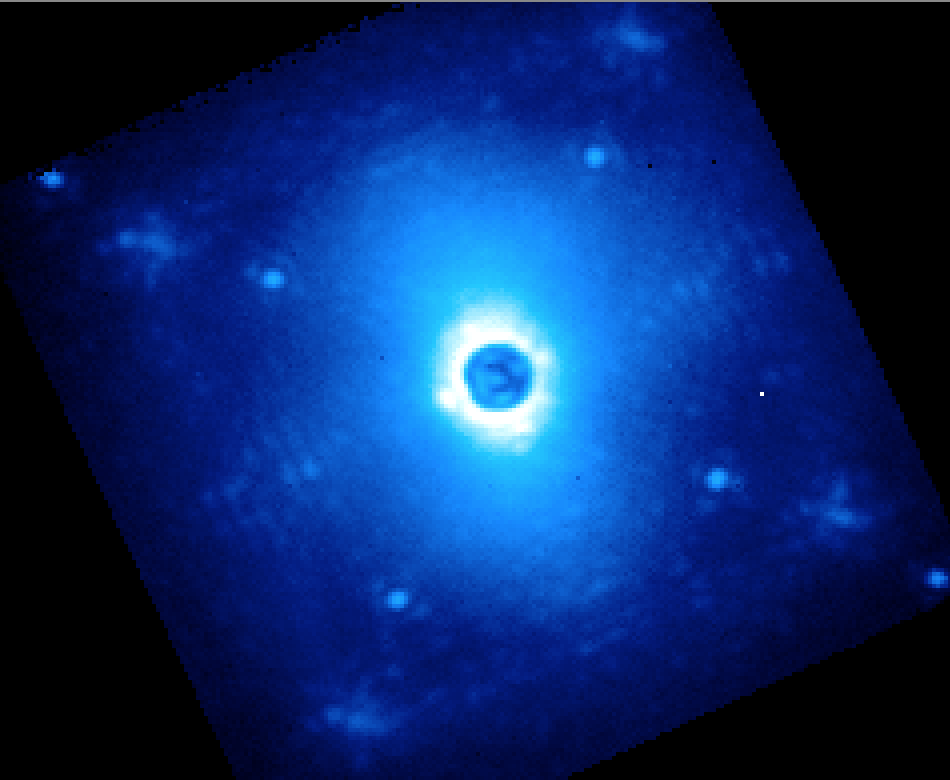
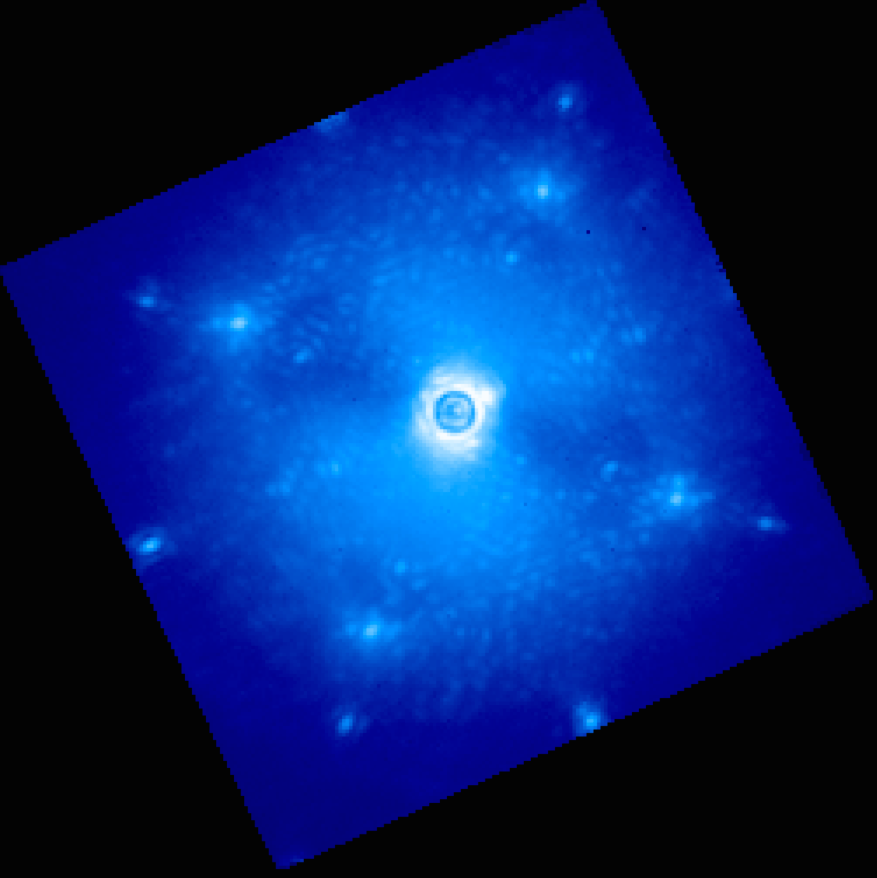
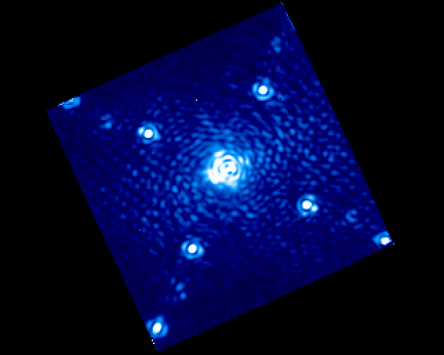
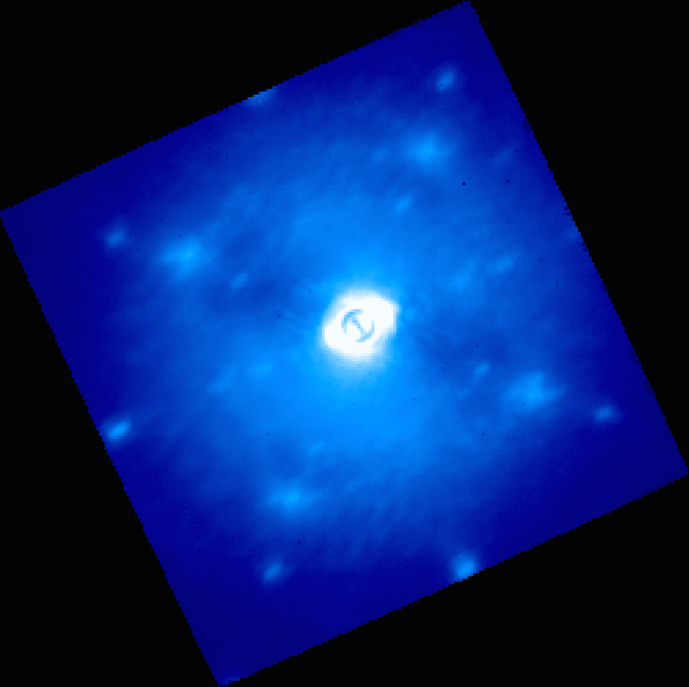
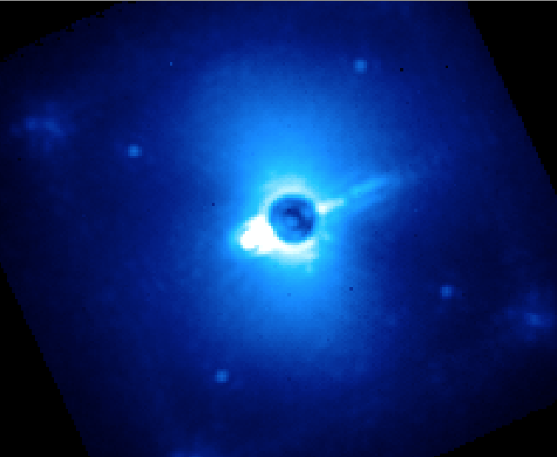
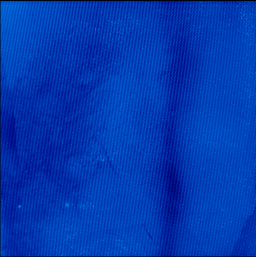
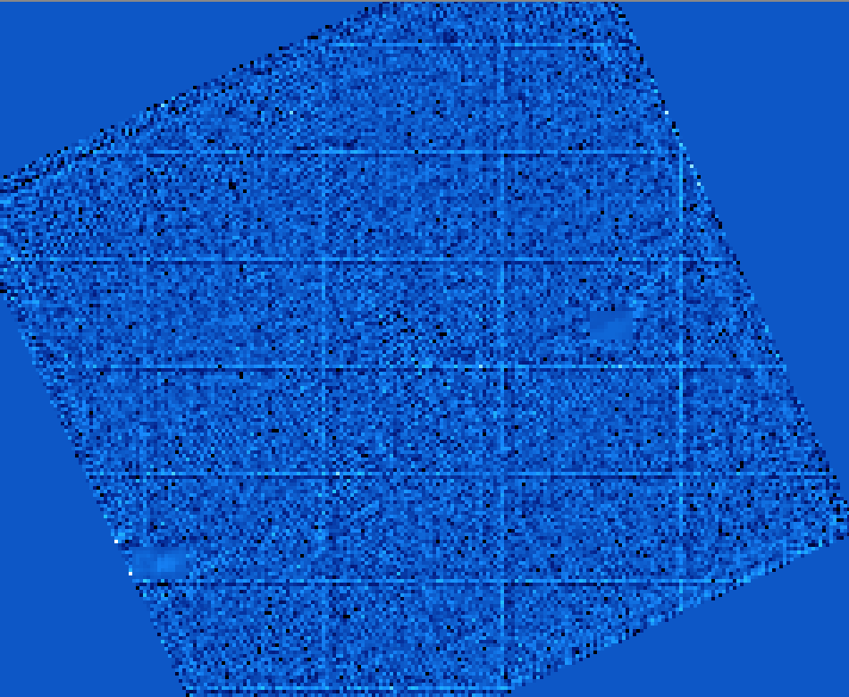

.. _ifs_data_gallery:

A Gallery of Example Data, Artifacts, and Noise Sources to be Aware Of
===========================================================================

This page is intended as a guide to some of the oddities 
that may occasionally crop up in GPI data. Its goal is to 
help users understand the physical origins of phenomenology seen in
GPI spectral and polarimetric datacubes, and to what extent
the data pipeline can help mitigate any given artifact (or not). 

Anatomy of a GPI Coronagraphic PSF
---------------------------------------

This is what your data *ought* to look like...

**Typical PSF under decent conditions:**

This is a single wavelength slice of H band data. 
You can see the 4 satellite spots, then the 4 more diffuse waffle spots, and then just visible near the upper left and lower right corners you can see two of the second order satellite spots. The waffle spots appear at the 4 corners of the AO dark hole.  These are all entirely normal features (changing in position with wavelength of course).

**"Butterfly" from wind**:

The so-called butterfly pattern originates from wind speed defining a preferred direction in the PSF halo. The orientation of the butterfly will depending on which way the wind is blowing across the telescope pupil. 

.. image:: badimg_02_Butterfly.png
        :width: 500px
        :align: center

**Other Wavelengths:**

Here's one in J band. Now you can also see the diffractive spots from the DM actuator print-through, right at the outer edge of the field. These appear at twice the size of the AO dark hole and waffle spots.   You can also see the butterfly in this one too. 

Artifacts from AO, Coronagraph, and Telescope Systematics
----------------------------------------------------------

If you see any of the following in your data, there is little the pipeline can do about them. These are all problems that the observer at the telescope should notice and try to fix in real time.

**Misaligned Focal Plane Mask:**

If you're operating the instrument, you should use the pointing offsets tool to recenter the star back onto the occulting mask. 

.. image:: badimg_03_MisalignedMask.png
        :width: 500px
        :align: center

**Misaligned Lyot Stop:**

This can only be corrected with the IDL engineering interface.  See: http://docs.planetimager.org/gpilib/calibrations.html#lyot-alignment

**Bad AOWFS darks:**

This creates an extended pattern in the "vertical" direction on the IFS, due to the orientation of the readout channels of the AOWFS. Fix by opening loops and taking new AOWFS darks. 

.. image:: badimg_04_WFSBias.png
        :width: 500px
        :align: center

**Misaligned observatory dome:**

The dome controller has crashed and you're clipping the telescope pupil on one side. Time to reboot the dome.   (Or else you started taking data before the dome finished rotating into position on the new target. Slow down!)

.. image:: badimg_05_Dome.png
        :width: 500px
        :align: center

**37 Hz secondary vibration:**

This problem appeared in January 2015 and intermittently affected observations. Sometimes it made the diffraction spikes start to reappear on either side of the occulter. Note the extended satellite spots, too. 

.. image:: badimg_06_37Hz.png
        :width: 500px
        :align: center

And sometimes it smeared the data out into an unusable mess: 

**Star temporarily moving from behind mask:**

Probably it's very windy. 

Artifacts from IFS and Detector Systematics
-----------------------------------------------

From here on out, the following are things the pipeline can potentially help you deal with. 

**Microphonics noise**

**Persistence**

.. comment:
 (Examples to be added of spec into pol, pol into spec, flat field into data, etc.)

Persistence can come in many forms, depending on what the prior illumination pattern shows. 

Here is an example of a *psf-subtracted* cube showing persistence. This is one
slice of a spectral cube, taken immediately after a polarization mode sequence
on the same target. Persistence from the polarimetry mode data causes a pattern
of horizontal stripes across the image; the specific stripe pattern is due to a
moire-type effect from the relative alignment of spectra versus pol spots on
the detector. The stripes march up and down across the detector as the
wavelength slice changes. 

.. image:: badimg_11_persistence.png
        :width: 500px
        :align: center

Here's another image, now showing what persistence can look like in a
relatively unprocessed datacube before PSF subtraction. The horizontal striping
is still distinctly visible on top of the usual PSF halo:

.. image:: badimg_14_persistence.png
        :width: 500px
        :align: center

The amount of persistence varies strongly across the detector. Here is a 2D image taken as a dark immediately after a very bright flat exposure, intentionally to highlight the persistence pattern:

This pattern, in particular the vertical stripe at center right with lower counts, is often a reliable indicator of cases where there is substantial persistence. 

Persistence of spectral data into pol data can give similar stripes as shown above, but at a different spatial frequency.  Here is a pol mode datacube generated from the same test data, showing horizontal striping (and also the region at center right with reduced persistence).

.. image:: badimg_13_persistence_pol.png
        :width: 500px
        :align: center

Persistence within the same mode is more subtle and harder to see than pol-to-spec or spec-to-pol, but is still there. 

The GPI instrument team is continuing to work on better calibrations of the detector persistence and methods to remove them in the pipeline.

**Lenslet 30x50 grid**

The lenslet array manufacturing process "prints" lenslets in blocks of 30x50.
This can be seen in spatially filtered flat fields as +-1% variation in the
apparent throughput of pairs of rows/columns every 30th row and 50th column.
Applying a suitable flat field should correct for
this effect in your data (but unless you're trying for <1% photometry on individual lenslets, this is likely to be negligible in practice.) 

Artifacts from Data Pipeline Systematics
-----------------------------------------

**Moiré from offset wavecal in datacube assembly**

If you try to create a datacube with a wavecal that is substantially offset
from the spectra (due to e.g. not correcting for flexure) then you can get some entertaining results.  Adjust the wavecal offset to get better cubes. 

.. image:: badimg_09_Moire.png
        :width: 500px
        :align: center

