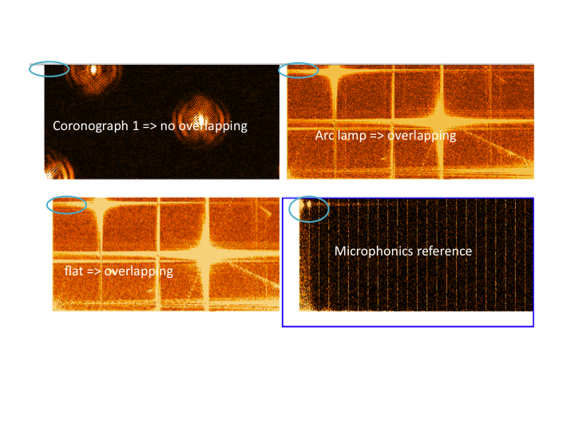
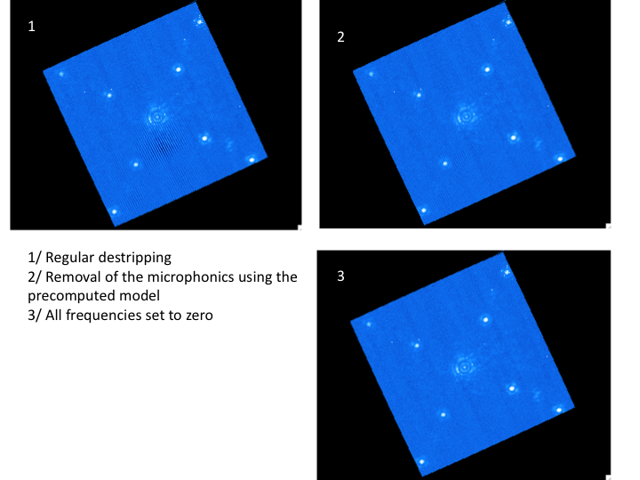

Destriping and Microphonics
============================

Observed Effect and Relevant Physics:
---------------------------------------

Beyond the standard Gaussian readnoise, the GPI detector is subject to 3 types of noise, each of which are referred to here as *horizontal striping*, *vertical striping*, and *microphonic noise*. All three of these patterns are easily identifiable in a standard 1.5 second dark frame, shown in figure below.

.. figure:: raw_dark_mod.png
        :width: 350pt
        :align: center
        :alt: alternate text
        :figwidth: 15cm 

	The red circles indicate sections of the detector heavily affected by the microphonic noise. The purple dashed lines indicate regions of horizontal detector striping and the green dashed lines indicate example of the vertical striping.

Each of the noise types are caused by different physical phenomena. The horizontal striping is due to noise in the readout electronics, likely the SIDECAR ASIC. During the early days of the integration and test of the IFS, the level of the noise was ~8x higher than it is today. This was determined to be an issue with the grounding of the detector. Although the striping appears to be broad stripes across the entire detector, it is actually intricate patterns that are present in every detector channel. It is this repetition that is used in deriving it's correction. The complexities of the patterns can be seen in the extracted noise pattern shown below. 

.. figure:: horizontal_striping_correction.png
        :width: 350pt
        :align: center
        :alt: alternate text
        :figwidth: 15cm 

	The horizontal stripe correction derived for the image shown in the previous figure. The microphonics and detector channel offset correction is not shown.

The vertical striping is caused by bias offsets of each of the 32 individual detector channels. This can be roughly modeled as a constant for the entire 64x2048 pixel channel, which is how the pipeline primitive derives its current correction. Like the horizontal striping, the pattern appears random between adjacent images, but long sequences show that the noise does possess a correlated component and that systematics are present in both cases. Due to the changing nature of this noise, a noise model must be derived for each individual image.

The microphonic noise is induced by vibrations from the Cryo-cooler motors. As the two motors move in and out of phase on a ~7 minute timescale, the pattern is observed to oscillate in intensity. The repeatability of the pattern and its affect at only certain frequencies allows for it to be filtered in Fourier space, so long as there is not a large amount of structure in the image (e.g. flat fields and arc-lamp images).

See below different examples of images in Fourier space (Note: the lowest frequencies are in the bottom right, the negative values are not shown). The blue circle enlightens the aera where the microphonics noise frequencies seems to be localized.

        
Using the Destriping Algorithms in GPI Data Reduction
------------------------------------------------------

The striping noise affects every image taken with the detector. The effectiveness of the pipelines ability to remove the striping is dependent upon the observation type. The ability to correct the striping is inversely proportional to the spatial distribution of light in the image. For example, a dark frame has no light in the image, therefore the entire detector can be used in deriving the striping correction. This is done using the pipeline primitive :ref:`Aggressive destripe assuming there is no signal in the image. (for darks only) <Aggressivedestripeassumingthereisnosignalintheimage.(fordarksonly)>`. 

In the case of science data (e.g. coronagraphic data), all of the microspectra are masked, leaving only the space between to derive the correction. This is done in the primitive :ref:`Destripe science frame <Destripescienceframe>`. There are selectable options for also removing microphonics and channel offsets as well as the basic horizontal striping.

For frames exhibiting large amounts of spatial structure (e.g. flats, arclamp images) then the amount of masking is too large, and the detector striping cannot be derived from the image itself. However, a partial correction can be applied by capitalizing on the four reference pixels on either side of the detector (note that reference pixels are photo-insensitive but exhibit the same readnoise). This is performed using the primitive :ref:`Apply Reference Pixel Correction <ApplyReferencePixelCorrection>`. This primitive is safe to use in all cases should the other methods fail.

* :ref:`Destripe science frame <Destripescienceframe>`:
	Different methods are available for Microphonics removal:

		- This algorithm is based on a fixed precomputed model (see :ref:`Create a microphonics noise model. <Createamicrophonicsnoisemodel.>` and below). This model is the normalized absolute value of the Fourier coefficients. The filtering consist of diminishing the intensity of the frequencies corresponding to the noise in the image proportionaly to the dot product of the image witht the noise model. The phase remains unchanged. This algorithm partially works and will succeed in removing a lot of the microphonics noise without jeopardize too much the image even in case of a structured image with overlapping frequencies with the noise. 
		- Setting all the frequencies to zero in the aera of the microphonics frequencies peaks. (Dangerous algorithm even if it might be fine regarding the different Fourier transforms, see image above.). This algorithm is the one used for dark images in :ref:`Aggressive destripe assuming there is no signal in the image. (for darks only) <Aggressivedestripeassumingthereisnosignalintheimage.(fordarksonly)>`.
		- Removal of 3 gaussian fits located to the 3 microphonics peaks. (Probably useless, it was only for testing but it is not as good)

The effect of the first algorithm in absolute Fourier space is shown below. The axes are not visible but you can clearly see the three peaks and how the algoritm diminish the amplitude to a level where you can see the background variations.

.. figure:: AlgorithmFourier.png
	:width: 500pt
	:align: center
	:alt: alternate text

* :ref:`Create a microphonics noise model. <Createamicrophonicsnoisemodel.>`:
	Build a microphonics noise model that will be used to quantity the noise in an image (using the dot product of the image on this model) and to remove it if necessary. There is no existing recipe template right now. The dependencies of the microphonics frequencies with other parameter has not been yet studied but it is unlikely to change very much. Therefore, one model for each cooldown should be enough. In order to build that model, this primitive extracts from dark images (with short integration time and visible strong microphonics noise) the absolute value of the Fourier coefficients in the aera of the identified peaks. No destripping should be done prior to this primitive. If there is more than one calibration file in the calibration database, the automatic selection will not work.

	- **Calibration DB File Type:**  Micro Model
	- **File Suffix:** microModel
	- **Generate with Recipe:**  None. The user has to build it himself with this primitive.

Things to watch out for:
--------------------------

The primary concern of the destriping algorithm is the possibility of it inserting systematic features into images due to a large amount of structure in the image that increases the region that is masked and therefore decreases the amount of detector available to derive the correction. For typical coronagraphic observations this is not a concern, but with extended objects this may become a concern. Because we have no data with spatially resolved objects, the destriping algorithms will be re-evaluated once on sky.

