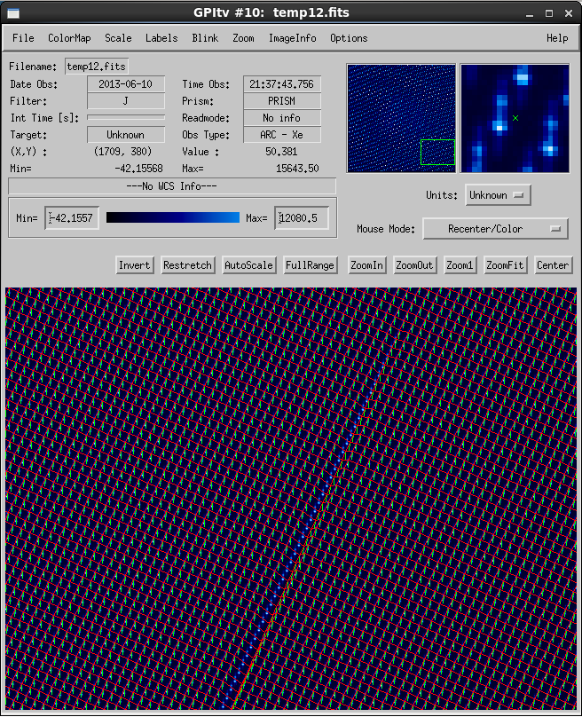

Wavelength Calibration
==================================

Observed Effect and Relevant Physics:
---------------------------------------

To perform GPI's exoplanet characterization science goals requires a wavelength precision of ~1%. However, the uniformity of the datacube is greatly increased with a better quality calibration. Performing a robust, high-accuracy wavelength calibration with GPI has been on of the primary challenges of the pipeline development. Similar to other near-IR spectrographs, GPI uses the well calibrated emission lines of a Xenon lamp (Argon also works for Y-band). The current accuracy of the wavelength calibration is below 0.5% for all bands. A new calibration based on forward modeling is also being developed. This routine is expected to both increase the robustness and precision of the calibration

Using Wavelength Calibrations in the GPI Pipeline
--------------------------------------------------

Most data reduction recipes for raw GPI data will begin by loading a wavelength calibration using the pipeline primitive :ref:`Load Wavelength Calibration <LoadWavelengthCalibration>`. Typically the calibration is obtained automatically from the :ref:`Calibration Database <calibdb>` based on the closest-in-time wavelength calibration file.  There are no significant user-selectable options for this step to be concerned with.

Creating Calibrations:
-----------------------

**Calibration DB File Type:** Wavelength Solution Cal File

**File Suffix:** wavecal

**Generate with Recipe:** "Wavelength Solution"

Take a series of arc lamp exposures (multiple exposures to increase S/N). Reduce these using the 'Wavelength Solution' recipe. This will create a references datacube that provides the starting x and y positions, the wavelength at those positions, the wavelength dispersion, and the tilt angle for each lenslet spectrum. This data cube may then be used to extract full spectral data cubes from science data.

Due to numerous close emission lines in Argon lamp data that are blended at GPI's resolution and therefore cannot be identified and discriminated, the Xenon lamp is recommended for all GPI wavelength calibrations. The Argon lamp can optionally be used in Y band for acceptable solutions, but is not recommended in other filters.

.. note::
        This recipe is somewhat computationally intensive, and will take 10-20 minutes to run on typical machines. 

Things to Watch Out For
-------------------------

Performing the wavelength calibrations are quite simple but ensuring that the determination was successful does require examination of the solution in GPItv (see the :ref:`Displaying GPI Wavelength Calibration feature <gpitv_wavecal_grid>` documentation). As the Gaussian fitting routines that determine the locations of the of spots are sensitive to bad pixels, it is recommended that a recent badpixel mask is used. The following figure shows the successful completion of a wavelength calibration.

.. figure:: good_wavecal.png
       :width: 400pt
       :align: center

The following figure demonstrates an unsuccessful calibration due to a bad pixel. The image shows the full detector, where the grid and dispersion lines appear uniform, only a small variation is seen in the lower right hand corner. 

.. figure:: bad_wavecal.png
       :width: 400pt
       :align: center

The following image shows a zoom on this region. The user should note that is an example of failure which is very difficult to see.

A successful determination of the calibration will show a clean grid of centroids (intersection of the red lines) with identical length dispersion axes (shown as green lines).

If you do experience a failed wavelength calibration, first check to make sure the correct dark and badpixel mask were used. If so, then one may modify the *maxpos* and *maxtilt* parameters. One may also change the interpolation type of the bad-pixel interpolation. In extreme cases, the bad pixel could be added to the mask manually, although this has never been necessary.

