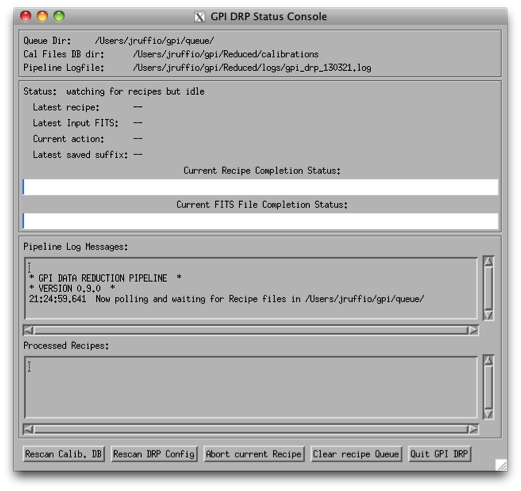
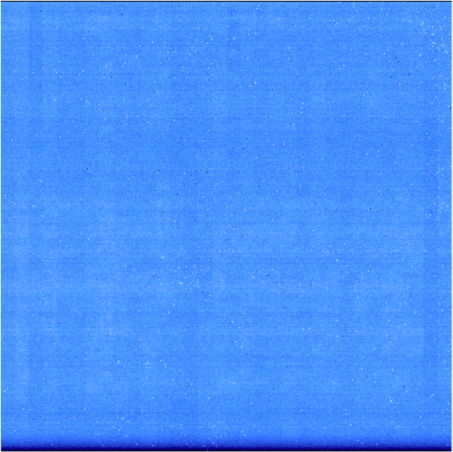
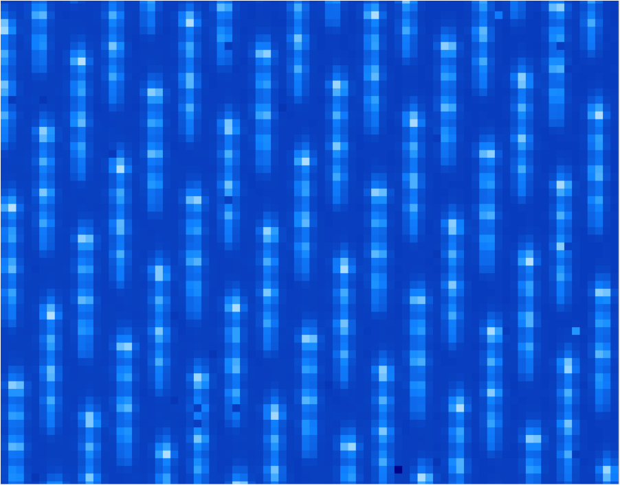
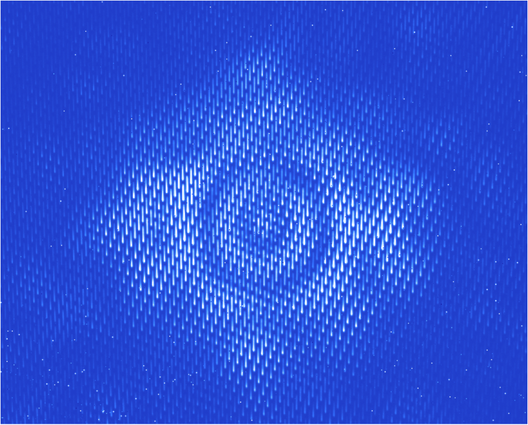
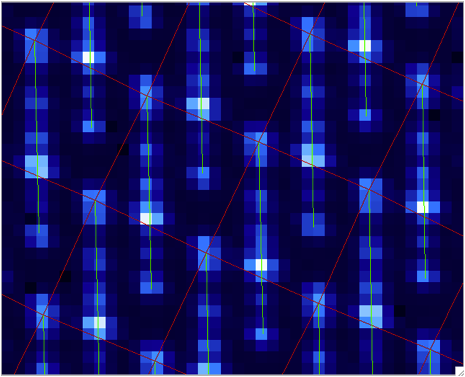
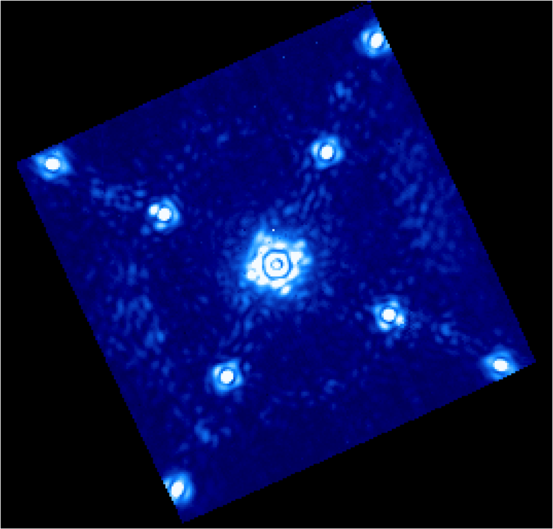

.. _usage-quickstart:

Quick Start Tutorial: Diving into data reduction
#####################################################

This is a quick tutorial to help new users become familiar with the GPI pipeline. More detailed
documentation of the tools shown here can be found on subsequent pages. 

.. Note:: It is important that the user follow the tutorial in the displayed order. Skipping steps will result in reduction errors (missing calibrations etc).

.. Note:: Although there is also a :ref:`tutorial for polarimetry data <usage-quickstart_pol>`, we highly recommend the user completes this tutorial first as it covers some pipeline fundamentals and aspects of using the GUIs that are prerequisites for the polarimetry tutorial.

Getting the Sample Dataset for this Tutorial
=================================================

As an introduction to reducing data with the GPI Pipeline, a simple set of data is available for download `here <http://docs.planetimager.org/GettingStarted_tutorial_dataset/GPI_spectral_tutorial.zip>`_ in the file ``gpi_spectral_tutorial.zip``.  Unzip that to get the tutorial dataset directory.

This directory contains a small set of data to give an overview of the different types of image and how to process them. All the files are raw data coming from the detector and we will reduce them one at a time.
The target is HD 8049, a K2 star with a white dwarf companion; see `Zurlo et al. 2013 <http://adsabs.harvard.edu/abs/2013A%26A...554A..21Z>`_.

The GPI Pipeline GUIs
==============================

It is assumed you have successfully launched the pipeline following the previous sections.(If not, see the :ref:`installation` manual.) Therefore, you should have the two IDL sessions opened with the GPI launcher GUI and the GPI DRP status console below. 
See :ref:`first-startup` for details.
 

The GPI pipeline console should indicate something like::

|    Now polling for DRF files in /Users/yourusername/somedirectory/GPI/queue/

The Launcher Window
---------------------
The Launcher is a little menu window that acts as the starting point for launching other tools. 
In this getting started tutorial, we will mostly use :ref:`GPItv <gpitv>` and the :ref:`Recipe Editor <recipe_editor>` tools.

.. image:: GPI-launcher.png
        :width: 348px
        :scale: 50 %
        :align: center
        
The Status Console
---------------------
This lets you see the current execution status, view log messages, and control certain aspects of the pipeline. 
See :ref:`status_console` for more details.

Exploring the Sample Dataset using GPItv
===========================================

.. image:: GPI-TV-steps.png
        :scale: 75%
        :align: center
        
Before reducing any files, the best is probably to take a look at the raw data we have using GPItv.
Click on the GPItv button on the GPI launcher to open it:

  1.  Then **File->Browse Files...**, 
  2.  In the new window push the button **Change...** and select a folder in the **GettingStarted_tutorial_dataset**. 
  3.  The **.fits** files list should appear. 
  4.  As you select one file or another, the GPItv window should refresh and plot the new image. 
  5.  Use the GPItv menu **File->View FITS headers...** to get detailed information for each image.
  6.  Click on the image to center the view on a pixel. Adapt the zoom with the buttons.

Feel free to experiment with the GPItv GUI and try out different functions. Most concepts should be straightforward to anyone familiar with `ds9 <http://hea-www.harvard.edu/RD/ds9/site/Home.html>`_ or especially `atv <http://hea-www.harvard.edu/RD/ds9/site/Home.html>`_. 

.. note:: 
	Details into GPItv functionality and operations can be found as part of the :ref:`GPItv <gpitv>` section of the documentation. 

Description and preview
--------------------------

* The two folders called **darks_60s** and **darks_120s** contain darks images with different integration times (respectively 58.19 and 119.29 seconds [#footnote1]_ ). An example of a raw dark image is shown below. We can see horizontal stripes caused by correlated noise introduced during the detector readout. They will be removed by the pipeline.

* The **wavelength_cal** folder contains Xenon arc lamp calibration data. An example image is shown below. These images are much more interesting because you can observe particular wavelength positions for the lenslets. These data are used to calibrate the wavelength solution for each of the different lenslets.  Given the orientations of IFS spectral prism and detector, shorter wavelengths are closer to the top of the detector for each lenslet (i.e. have higher Y pixel values) while longer wavelengths extend down toward the bottom. 
        

       
* The **onsky_data** directory contains a raw coronagraphic image that we wish to reduce (the central section is shown below). Each microspectrum consists of the light from a 14.3 by 14.3 milli-arcsecond section of the field of view. The pipeline will extract each spectrum and create a 3 dimensional data cube, where each 2-dimensional slice of the cube corresponds to a given wavelength.  

.. rubric:: Footnotes

.. [#footnote1] 
  The reason for these odd exposure times is that GPI IFS exposures are quantized in units of the readout time for the detector, 1.45479 seconds. Because of this quantization, in practice one typically just rounds the durations, so these would be e.g. "60" and "120" second exposures - there's no need to carry around all the significant figures. 

Adding pre-created Calibration Files to your Calibrations Directory
================================================================================
        
The **files_to_go_into_calibrations_directory** directory contains files that must be copied over into your :ref:`calibrations directory <config-envvars>`. By default this is the path ``$GPI_REDUCED_DATA_DIR/calibrations``.   Files in this directory include a bad pixel map, a microphonics model, and a flexure shifts lookup table.  

After copying these files into the calibration directory, the user *must* click on **Rescan Calib. DB** button, located in the bottom left hand corner of the GPI DRP Status Console.  Whenever you manually put some file into (or remove a file from) the calibrations directory, you need to make the pipeline aware of this change.  The **Rescan Calib. DB.** function  will reindex all the FITS files in that directory and register any new files in the calibration file database. That enables the pipeline to find them during subsequent reductions.  

General reduction method
==============================

Let's first discuss the general method to reduce any file. This will then be applied in the next sections for different particular cases. Only the selected items in the different option lists will change.

Press the **Recipe Editor** button in the GPI Launcher window and the window below will open.

.. Note:: The principle of the pipeline is based on recipes to reduce files. A recipe includes a list of input files (the ingredients) and a list of primitives to be applied on those files (the actions). Each primitive is an elementary algorithm to be applied on files listed in the recipe. The action can be anything, for instance subtract dark frame or build data cube. There are two kinds of primitives: ones that should be applied on each file and ones that are applied on all files together. For instance, **Subtract Dark** acts on one file at a time, while **Combine 2D images** will merge all the files from the list resulting in a single output file. The special primitive **Accumulate Images** divides the two categories of primitives.  All the primitives before are applied to each file, then Accumulate Images gathers up the results, and any primitives after are applied to the entire set.

.. image:: recipe-editor-steps.png
        :scale: 75%
        :align: center
        
The numbers of each of the following steps match with the screenshot above.

1)	Press the upper-left button **Add File(s)** and select the files to reduce.
2)	The selected files should appear just below.
3)	Select the reduction type in the menu.
4)	Select a Recipe Template. You may want to change the recipe if it doesn't match exactly to your expectation. It is possible to add, move and remove any primitive and also to change various input parameters that adjust algorithm details. For any primitive that requires a Calibration file, this will automatically be chosen from the Calibration Database. The user can Manually select a calibration file by selecting the primitive and clicking the **Choose Calibration File...** button in the lower right hand corner. 
5)	Press **Save Recipe and drop in queue** button. This will generate the recipe based on the selected files and the list of primitives. The recipe is automatically saved in the queue directory, meaning that it will be read as soon as the pipeline is idle. The reduction might take a while depending on the computer.

In the following, these steps will be repeated several times with specific indications. 

.. note:: 
	For every reduction, a gpitv window will open with the result of the reduction and the file will be saved in the reduced files directory defined when installing the pipeline. If you don't want to plot or to save the results, you can change the parameters **Save** and **gpitv** of the primitives.
	To change parameters, select the primitive in the upper right table. Then, its parameters will appear in the bottom right table. Select the value of the parameter and type what ever is asked. Finally, press enter to validate the input.

.. note:: The recipe templates assume a particular context and will only work on the proper type of input files, meaning that if you try to apply one of them to a random file it probably won't work. In general, this should just result in the recipe being marked 'Failed', and the pipeline will return to awaiting the next recipe.  Feel free to experiment - the worst thing that should happen is you can get non-useful output files. It should be hard to actually crash the entire pipeline software stack, so if you do manage to do this somehow, you've probably found a bug which you can report. 

Reduce your calibration and Science files
=========================================

Darks
--------------------

The dark calibration files for a given integration time can be combined using these amendments to the Recipe Editor usage steps above:

- **For step 1)** Select the 60s darks using the Add File(s) button: **S20131208S0016(-20).fits**
- **For step 3)** Change the reduction category to **Calibration** 
- **For step 4)** Select the **Dark** Recipe template from the dropdown menu

The 60s darks correspond to the science data and will be used in the following section.

The selected primitives are then:

- Aggressive destripe (assuming there is no signal in the image): This should remove the apparent lines in the image that come from the readout of the pixels by the detector.
- Accumulate Image: Gather all the images of the recipe. It indicates that the subsequent primitives will apply to all images.
- Combine 2D dark images: Merge all the images with the same integration time using the median.

The GPI DRP Status Console will display a progress bar and log messages while reducing the files.

When reducing calibration files the result is automatically saved in the Calibrations folder. By default, the path to this folder is ``$GPI_REDUCED_DATA/calibrations`` (note that one may have changed it manually using the ``$GPI_CALIBRATIONS_DIR`` system variable see :ref:`configuring` for details).

The pipeline will look for calibration files automatically by reading the text file **GPI_Calibs_DB.txt** in the calibration folder (see :ref:`calibdb`). There is a button at the bottom of the **GPI DRP Status Console** called **Rescan Calib. DB** to create or refresh this text file. 

Use the button **Remove All** to remove all the selected files. then redo the above steps for the 120s integration times using files  **S20131208S0021(-22).fits**. This newly created dark frame will be used to reduce the wavelength calibrations in the next section.

.. note::
	More information on the GPI dark frames and destriping can be found as part of the :ref:`GPI IFS Data Handbook <ifs-data-handbook>`, under the :ref:`Processing GPI Data, Step by Step <processing_step_by_step>` in the Darks and Destriping sections.

	
Wavelength solution
-----------------------

Like the dark frames, the wavelength solution calibration files can be created using the Recipe Editor. However, the wavelength calibrations are computationally intensive and sensitive to their starting parameters. Therefore master wavelength calibrations are provided by Gemini and available for download at the `Gemini Public Data webpage <http://www.gemini.edu/sciops/instruments/gpi/public-data>`_. What we recommend is to take a master wavelength calibration, then calculate the flexure offsets between the master and the arclamp snapshot image taken with your science. 

For the purposes of this tutorial, we recommend users download the Wavecals.zip file available on the `Gemini Public Data webpage <http://www.gemini.edu/sciops/instruments/gpi/public-data>`_. Then add the files to the calibration directory. The user must then update the calibration database by clicking the **Rescan Calib. DB** button, found in the lower left corner of the GPI DRP Status Console Window. 

At this point, the user may (and probably should) skip to the next section, where the wavecals are discussed a little further down. However, should one wish to try to construct one on their own wavecales, follow the reduction steps below.

Note that his is a very computationally intensive reduction and it may take some time (>15 minutes) to complete. It also requires a reference wavelength solution in the same band as the observed arc lamp data which is included in the Wavecals.zip file mentioned just above. Upon completion, it will ask if you would like to overwrite the file, for the purpose of this exercise one should rename the file so it can be recognized from the original (e.g. S20131208S0150_H_wavecal2.fits). An error will then pop up saying the wavelength calibration failed the quality check, this is due to lower signal-to-noise arc lamp images than what is used to derive the more recent wavecals. The quality of the solution is still adequate so you may save the image (which will put it in the calibrations directory) and continue.

 
- **For step 1)** Select Xe-arc lamp files using the Add File(s) button: **S20131208S0149(-151).fits** (located in the wavelength_cal folder) 
- **For step 3)** Keep selected the **Calibration** reduction category
- **For step 4)** Select the **Wavelength Solution 2D** Recipe template

.. note:: The wavelength calibration requires a complex algorithm. :ref:`Wavelength Calibration <wavelength_calibration>` describes the process in more detail and provides examples of common errors with solutions. 

A sample of the 2D image with the computed wavelength calibration is given below. In order to see how your wavelength solution compares with the data, one can open an image (e.g. S20131208S0150.fits) in GPItv (this is done either from the GPI Launcher or from just double clicking on the file name in the Recipe Editor). The user then selects their wavecal by selecting "Labels"->Select Wavecal/Polcal file, then selecting the desired wavelength calibration from the list. The user then selects "Labels" -> Plot Wavcal/Polcal Grid. The green lines are the locations of the individual lenslet spectra. The coordinates of the lenslets are stored in a .fits file cube in the **calibrations** folder. 

Reducing your science data
==============================

The following is an example of how to reduce science data. Start by creating a new recipe (File -> New Recipe)

- **For step 1)** Select your science data files from the onsky folder using the Add File(s) button **S20131210S0025.fits**
- **For step 3)** Change the reduction category to **SpectralScience** 
- **For step 4)** Select the **Quicklook Automatic Datacube Extraction** Recipe template

All the calibration files are automatically found and the result is a final data cube that should be plotted in GPItv at the end of the reduction. Note that the recipe may fail due to an inability to find the satellite spots. We'll just ignore this for the time being. Feel free to look at the different wavelengths by changing the selected slice. Note that we have not yet accounted for the flexure offsets between the wavelength calibration derived above, and the current spectral positions, therefore the reduced cube will be rather ugly and have a large Moire pattern in the data.

.. image:: bad_data_cube.png
        :scale: 50%
        :align: center
        
In order to correct for this, we must account for the offsets. To do this in an approximate manner, one should open the raw image in GPItv (S20131210S0025.fits), then overplot the wavelength soluution (Labels -> Get Wavecal from DB, then Labels -> Plot Wavecal Grid -> Draw Grid), one will see the large offets (shown below).

.. image:: offset_wavecal.png
        :scale: 50%
        :align: center

As a rough approximation, one can input offsets in GPItv (in the plot wavecal grid) until the overlap looks correct (note that old drawings of the wavecal can be erased by Labels -> Erase All). An (X,Y) shift of (-2,1) is a reasonably good guess. The user can then input these offsets into the :ref:`Update Spot Shifts for Flexure <UpdateSpotShiftsforFlexure>` primitive. To do this:

1. Click on the :ref:`Update Spot Shifts for Flexure <UpdateSpotShiftsforFlexure>` primitive in the recipe window. 
2. Change the method keyword to, "Manual" in the primitive parameters window (just below the recipe window)
3. Change the manual_dx and manual_dy keywords to the desired values.
4. Re-run the reduction (Save Recipe and Queue)

.. note:: Another more automated way to do this that is not described here utilises the "Move wavecal grid" Mouse Mode in GPItv.

Because a snapshot of the Argon arclamp was taken at the same telescope position, we can use this to determine the needed offsets in a much more robust fashion. So start a new recipe (File -> New Recipe) and perform the following steps:

- **For step 1)** Select the Ar-arc snapshot taken with the data (found in the onsky_data folder): **S20131210S0055.fits**. 
- **For step 3)** Change the reduction category to **Calibration** 
- **For step 4)** Select the **Quick Wavelength Solution** Recipe template from the dropdown menu

This primitive will use every 20th lenslet in the frame to calculate the net shift from the desired wavelength calibration. One must be careful to ensure the proper wavelength calibration is grabbed from the database (check the output in the pipeline xterm). If the wrong one is selected, then you can manually choose the correct one (S20131210S0055_H_wavecal.fits) using the Choose Calibration File button. A new wavecal (S20131210S0055_H_wavecal.fits) will then be added to the database, which is merely the old wavecal with new x-y spectral positions.

.. note::
	Handling flexure with GPI data is an important aspect of GPI data reduction. The effects of flexure and how to deal with it are addressed in detail as part of the :ref:`GPI IFS Data Handbook <ifs-data-handbook>`, under the :ref:`Processing GPI Data, Step by Step <processing_step_by_step>`. It is highly recommended that users should consult this guide prior to reducing their data.  The most robust approach observationally is to make sure that at least one arc lamp calibration exposure is taken contemporaneously with your science data, as in the case of the Ar snapshot for the dataset discussed here.  We hope to have improved automated algorithms for measuring flexure on science data ready by 2014B.

If you now repeat the reduction of the science data from above, the new wavecal will be captured and the datacube will appear as follows. Remember to set the ``method`` parameter in the :ref:`Update Spot Shifts for Flexure <UpdateSpotShiftsforFlexure>` primitive to `none` or `Lookup`.

**Enjoy the first of many data cubes!**

