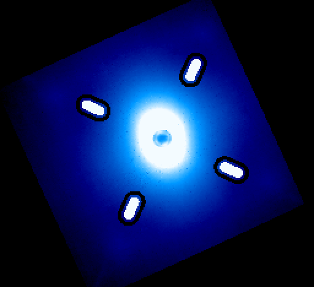
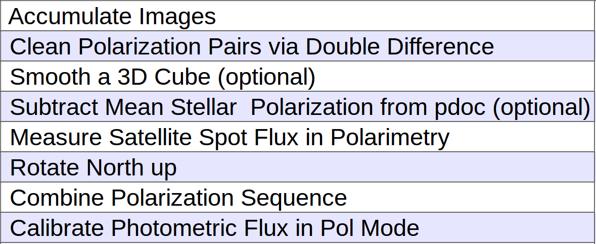
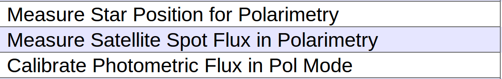

.. _usage-tutorial_polphoto:

Tutorial 5: Photometric Calibration For Coronagraphic Imaging in Polarimetry Mode
======================================================================================

.. warning::
   Photometric calibration for coronagraphic data can 
   be tricky. There is more than one way to do this. As always users are responsible for
   using their own scientific judgement, checking their results, 
   and not relying solely on the pipeline as a black box. 

   We encourage users to develop their own approaches to accurately calibrating
   their GPI data and assessing the uncertainties and biases. The following is our
   suggestion of one possible approach to photometric calibration.

   Furthermore, as soon as one adds in the complexity of PSF subtraction, 
   that brings a lot of additional complexity in understanding the algorithm throughputs
   and biases of that process. This issue is not described in this brief introduction.

The goal for doing photometric calibration is to convert the observed data from the default analog-to-digital unit per coadd (ADU/coadd) into a physical unit (i.e., Jy). When observing in the coronagraphic mode with GPI, the star is behind the occulter. Thus, the photometric calibrations rely on using :ref:`satellite spots <processing_step_by_step_flat_fielding_satellite_spot_calibrations>`, which are diffracted starlight formed by a square pupil-plane grating.

The principle for doing the photometric calibration in polarimetry mode is the same as in spectral mode (see :ref:`tutorial 4 <usage-tutorial_spectrophoto>`), except for some small differences such as in polarimetry mode, there are no spectra involved and the satellite spots are not diffraction-limited PSFs but are smeared out into long oval shapes due to their chromaticity. Below shows the principle of the photometric calibration method considered here.

.. math::

        Datacube [Jy] = \frac{Datacube\ [ADU\ coadd^{-1}] * Satellite:Star\ Flux\ Ratio * Host\ Star\ Flux\ [Jy]}{Avg.\ Satellite\ Flux [ADU\ coadd^{-1}]}

The above equation is coded in the primitive :ref:`Calibrate Photometric Flux in Pol Mode <CalibratePhotometricFluxinPolMode>`. The final calibrated image will have real physical units. The input image should be a podc-like cube and has the default unit of [ADU per coadd]. The Satellite spot to star flux ratio here only depends on the grid density of the apodizer used, and the values can be found in config/apodizer_spec.txt. The known stellar flux value in the observed wavelength should be provided by the user (i.e. using 2MASS flux). Corrections between 2MASS and GPI magnitudes in `J` and `H` filters were found to be negligible (`Macintosh et al 2015 <http://arxiv.org/abs/1508.03084>`_). The measured average satellite spot flux of the input image from using the primitive :ref:`Measure Satellite Spot Flux in Polarimetry <MeasureSatelliteSpotFluxinPolarimetry>`. This primitive uses an elongated aperture similar to the shape of a running track to perform aperture photometry on the satellite spots in polarimetry mode.

   The above image shows the apertures used for performing photometry of the satellite spots. The apertures used for measuring the fluxes of satellite spots are shown as white ovals. Here, the exact shape of the oval is composed of a semicircle attached to each end of the long axis of a rectangle. To measure background noise, we use a region (black) that resembles a racetrack around the aperture.

The primitive :ref:`Measure Satellite Spot Flux in Polarimetry <MeasureSatelliteSpotFluxinPolarimetry>` will behave differently depending on where in the recipe it is placed. If it is placed before Accumulate Images primitive, then it operates on each input file individually, saving the measured fluxes of each satellite spot in each polarization to the header of each file. If it is placed after Accumulate Images primitive, then it performs on the stack of images averaged into one image for better SNR. It then saves the average sat spot fluxes in the header of each cube. 

Example recipe for making a calibrated Stokes cube from podc files
--------------------------------------------------------------------

The input files should be `podc` files. Users can start with setting the reduction category to `PolarimetricScience` and select the recipe template `Basic Polarization Sequence (from podc cubes)`. Then users can modify the recipe so that it looks like:

Reminder: Users must enter the stellar flux in [Jy] in the `Calibrate Photometric Flux in Pol Mode` primitive. Entering the error on the stellar flux and the desired output unit are optional.

If the final image is saved, it should have the suffix `_phot`. Users can check and verify the current unit of the image by looking at the header keyword `BUNIT` under header extension 1 or the information displayed on the right hand side of the GPItv. The calculated conversion factor and its percentage error are saved in the header keyword `CALIBFAC` with the unit [Jy/(ADU/coadd)] and `CALIBERR` with the unit [%] under header extension 1. Usually 1 [ADU/coadd/s] is somewhere between (5~9)e-07 [Jy]; the exact value varies between datasets due to differences in data quality. The percentage error is propagated from the uncertainties of the measured satellite spot fluxes and the input stellar flux. Note that this final uncertainty is calculated assuming each uncertainty is random and independent, and this might not be the most accurate way to estimated the final uncertainty. 

Example recipe for calibrating individual podc cube
--------------------------------------------------------------------
All the steps and things to note are the same as the above example, except for setting the recipe to the following:

 

