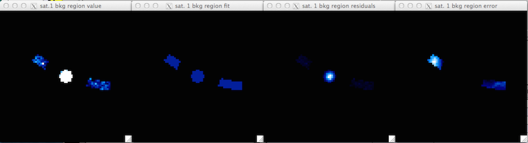
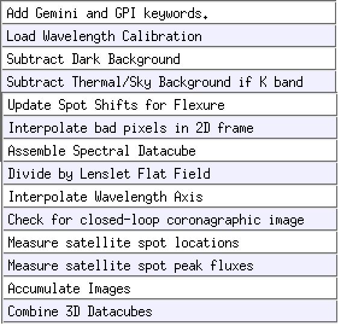
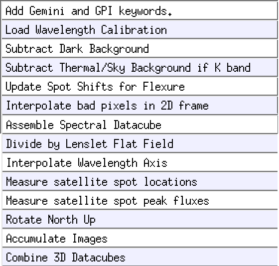

Tutorial 4: Spectrophotometric Calibration For Coronagraphic Imaging Spectroscopy
======================================================================================

.. warning::
   Photometric calibration for coronagraphic data can 
   be tricky. There is more than one way to do this. As always users are responsible for
   using their own scientific judgement, checking their results, 
   and not relying solely on the pipeline as a black box. 

   We encourage users to develop their own approaches to accurately calibrating
   their GPI data and assessing the uncertainties and biases. The following is our
   suggestion of one possible approach to photometric calibration.

   Furthermore, as soon as one adds in the complexity of PSF subtraction, 
   that brings a lot of additional complexity in understanding the algorithm throughputs
   and biases of that process. This issue is not described in this brief introduction.

Applying a spectrophotometric calibration to your reduced GPI datacubes transforms the units of extracted spectra from intensity in ADU (aka counts or data numbers) into a physical flux unit (e.g. ergs/s/cm2/A or Jy). The GPI Data Reduction Pipeline (DRP) includes functionality (in the form of primitives) to help a user extract a calibrated spectrum with relative ease. However, as mentioned above, we encourage users to develope their own approaches to ensure no biases are introduced into the data. That being said, the procedure described here provides a good background to the problem and a quick way to create calibrated data that can be used as initial comparisons to models or as a metric for evaluating the quality of your own extraction algorithm.

The spectrophotometric calibration on coronagraphic data described here uses the the spectra extracted from the satellite spots in the image, combined with the spectral type and apparent magnitude of the host star. Because the light from the host star and companion experience the same atmospheric and instrumental transmission functions, if we know the luminosity (magnitude) of the host star and it's spectrum, we can calibrate the datacube using the following equation:

.. math::

        datacube [flux\  units] = \frac{datacube[ADU]}{Avg.\ Satellite\  spectrum [ADU]} * \frac{Host\  Star\  Spectrum\  [flux\  units]}{Satellite:Star\ Flux\ ratio [unitless]}

This calibration is done using the pipeline primitive :ref:`Calibrate Photometric Flux <CalibratePhotometricFlux>` primitive. This primitive measures the average satellite spectrum, uses the stellar magnitude and spectral type to determine a flux-calibrated star spectrum, and uses the satellite flux ratios from the $GPI_DRP_CONFIG_DIR/apodizer_spec.txt file (see :ref:`here <processing_step_by_step_flat_fielding_satellite_spot_calibrations>` for more information on the satellite spots) in order to use the above formula to derive a calibrated datacube.

.. warning:: 
   If you're using non-coronagraphic direct data, it doens't have sat spots
   so the following method doesn't apply. Likewise for polarimetry data the
   calibration is more complex since the spots are extended, and this is not
   yet well implemented. In these cases, you can rely on the more traditional
   method of observing a photometric standard star, measuring its counts, and
   deriving a conversion factor from counts/sec to physical units. 

Naturally, this relative calibration (companion flux relative to the host star) is very sensitive to the assigned characteristics of the host star. Under normal observing scenarios, the host star spectral type and magnitude is transferred into the image headers from the values entered into the Gemini Observing Tool (OT) during the Phase II process of the observation planning, however, these values may correspond to (slightly) different filters and often have a mildly incorrect spectral type. Users can update these values (or add them if for some reason they do not appear in the headers) by updating the *SPECTYPE* and *HMAG* in the primary header using the ``Add Gemini and GPI keywords`` primitive. Note that this primitive is only visible when `Show all primitives` is selected from the `Options` dropdown menu in the recipe editor. 

The *SPECTYPE* header keyword is used to automatically select a Pickles stellar model to be used as the star spectrum. Note that not all spectral types have associated models, if one wishes to see which models are available, they can look at the following file $GPI_DRP_CONFIG_DIR/pickles/AA_README. **Note that these models are not always perfect and if incorrect, will imprint a systematic error in your data.** For this reason, the primitive also supports a user-defined spectrum for the host star which is declared using the 'calib_model_spectrum' keyword (note that the directory must also be included). The input file must consist of 3 columns: wavelength, flux [erg/s/cm2/A], and the uncertainty. The spectrum is interpolated to the GPI filter wavelengths and therefore must already be binned to the GPI spectral resolution.  

Because the filter type of the magnitude is often based on the 2MASS filter system, the :ref:`Calibrate Photometric Flux <CalibratePhotometricFlux>` automatically calculates and applies to conversion to the GPI filters based on the Pickles model.  If the *SPECTYPE* keyword is set to `GPI` instead of `2MASS`, then no filter conversion is applied. A correction for the star colors variation with spectral type is also applied (e.g. calculation of J-band magnitude based on an H-band magnitude for a given spectral type. Should the user supply a host-star spectrum using the 'calib_model_spectrum' described in the paragraph above, these corrections are skipped.

The spectral extraction of the satellites in the :ref:`Calibrate Photometric Flux <CalibratePhotometricFlux>` primitive is performed using aperture photometry where the circular extraction aperture radius is set using the `extraction_radius` keyword. The value inserted is used for the central slice of the datacube, and then scaled with wavelength (by default). The scaling of the aperture with wavelength can be removed by setting the `c_ap_scaling` keyword to '0'. The area to be used to measure the sky subtraction is defined using the `inner_sky_radius` and `outer_sky_radius` keywords. Admittedly, these keywords are misnomers as the sky is not extracted using a circular annulus around each satellite. The sky is measured from an partial annulus at the radius of the star-planet separation measured along an arc, where the width of the arc is defined by the `extraction_radius`. The `inner_sky_radius` sets the size of the mask over the satellite and the `outer_sky_radius` sets the distance from the satellite to the edge of the annulus in consideration. Because it is non-trivial to conceptualize this shape, the extraction aperture for slice 15 (approximately the central wavelength slice) is always displayed, as shown in the following figure.

    The displayed output from extracting a single wavelength of the spectrum of a satellite spot. This display is useful for determining where the background is being measured.
  
   
The leftmost image in the above figure shows a cutout of the extraction annulus including the satellite spot, as well as the region used for measuring the background and determining the error. The second image from the left shows the calculated value of the background (the median pixel), the third window from the left shows background-subtracted pixels. The rightmost image shows the convolution of the background pixels with the extraction aperture (note that the convolution uses pixels from the datacube slice that appear masked in the above image). The standard deviation of this area is used as the errorbar on the extracted datapoint.

The individual satellite spectra are normalized to mean integrated intensity of the four spots. For each wavelength slice, the mean of the four satellites is used, whereas the error is the standard deviation of the four spots. A future version of the pipeline will incorporate a weighted mean and standard deviation.

Applying the spectrophotometric correction can be accomplished in two ways:
	1. On a cube by cube basis. This is only feasible if you have a good SNR on each satellite spot.
	
	2. On a combined sequence. This is useful if the SNR of the satellites is low.

Calibration Cube-by-Cube
--------------------------------

This method uses the satellites in a single cube to perform the calibration and is the method assumed when using the *Calibrated Datacube extraction* recipe. This requires a high SNR of the satellite spots (and subsequently the companion if one wants to extract a spectrum). The user creates their normal (uncalibrated cube) then uses the :ref:`Measure satellite spot locations <Measuresatellitespotlocations>` and :ref:`Measure satellite spot peak fluxes <Measuresatellitespotpeakfluxes>` to characterize the satellites. Susequently, the user calls the :ref:`Calibrate Photometric Flux <CalibratePhotometricFlux>` primitive to create a calibrated cube. At this point, the user can either combine multiple calibrated cubes, or simply use the :ref:`Extract 1d spectrum <Extract1Dspectrumfromadatacube>` to obtain a flux calibrated spectrum of the companion (addressed below).

 
Calibration on combined sequences
---------------------------------------

In cases where the satellite spots and or companion is faint, it is often wise to combine the images to obtain a higher signal-to-noise ratio (SNR) prior to extracting the spectra. This increase in the SNR is also important for improving the position accuracy of the satellites and companion prior to their extraction. The challenge with stacking the cubes is that the field is constantly rotating, therefore, a median stack of all the cubes does provide an increase in the SNR of the satellite spots and speckles, but this results in a blurring-out of the planet. Therefore, one must make a second median combined stack of datacubes, where each cube is rotated to have north up (using the :ref:`Rotate North Up <RotateNorthUp>`  primitive) prior to the median combine. This results in an increase in the SNR of the planet, while blurring out the speckles and satellite spots. Once these cubes are made, they can be inserted into the :ref:`Calibrate Photometric Flux <CalibratePhotometricFlux>` primitive to obtain a proper flux calibration. 

.. figure:: fig_median_stack.png
   :width: 300px
   :align: center
   :alt: alternate text
   
   A single wavelength slice from stacking several datacubes of a well-known system of companions. Note that no companions are visible but the SNR of the satellites is decent.
	
To create this stack, the following recipe of primitives was used. 

   The recipe used to create the median stack of several datacubes (shown above).

Note that in the case below the satellite spot locations were measured BEFORE doing a median of the stack. It is also possible to place them AFTER the Combine 3d Datacubes primitive. However, if this is done, one must be sure that the SAVE parameters in the :ref:`Measure satellite spot locations <Measuresatellitespotlocations>` and :ref:`Measure satellite spot peak fluxes <Measuresatellitespotpeakfluxes>` primitives are set to 1. In this example, I've also modified the *SPECTYPE* and *HMAG* keywords using the ``Add Gemini and GPI keywords`` primitive mentioned above. 

One should note that the file produced by this recipe should be MANUALLY changed to something such as 'S20131118S0012_median_stack.fits' or else it will be overwritten in the next step, where we create a stack of derotated cubes.

.. figure:: fig_derotated_stack.png
   :width: 300px
   :align: center

   A single wavelength slice from stacking several datacubes of a well-known system of companions AFTER having rotated each individual cube to have North in the 'up' direction. Note that the companions are now visible but the satellites have been blurred out.
	
Now that we have a cube with high-SNR satellites, we need to create a cube where the companion has a higher SNR, this is done by rotating each individual cube using the :ref:`Rotate North Up <RotateNorthUp>`  primitive, which is the placed before combining the cubes, as shown in the following recipe.

   The recipe used to create the median derotated stack of several datacubes (shown above).

The cube produced by this receipe is the cube that users will want to flux calibrate, since it will contain the signal from the companions. However, the satellites used to calibrate the cube, are contained in the previous cube. The :ref:`Calibrate Photometric Flux <CalibratePhotometricFlux>` primitive handles this by allowing the user to input the directory+filename of the satellite cube (the median stack) in the `calib_cube_name` keyword. The derotated cube should loaded by the recipe editor, as is seen in the figure below.

.. figure:: fig_two_cube_calibration_recipe.png
   :width: 600px
   :align: center

   The recipe used to calibrate a derotated median stack (high SNR of companions) using the satellites for a standard median stack (high SNR satellites).

Note that the user should choose the type of units they desire using the 'FinalUnits' keyword. Note that if the user desires the final units in ADU/coadd, this relies on a instrumental response function which is not yet implemented. Currently, the filter profile normalized to the level of the approximate broadband instrument transmission is used instead. Therefore, one should approach these values with extreme caution. 

Upon completion of the :ref:`Calibrate Photometric Flux <CalibratePhotometricFlux>` primitive, a calibrated cube will be output. Note that in order to eliminate any systematics introduced by the primitive (e.g. flux loss due to the chosen extraction aperture), one MUST extract any spectra using the :ref:`Extract 1d spectrum <Extract1Dspectrumfromadatacube>`.  

Extracting a 1-D spectrum of a companion
---------------------------------------------

The extraction of a 1-D spectrum from a calibrated datacube is accomplished using the :ref:`Extract 1d spectrum <Extract1Dspectrumfromadatacube>` primitive. The units of the spectrum will be in the same units that was used to calibrate the datacube (discussed above).

The only mandatory inputs to the primitive are the `xcenter` and `ycenter` keywords. If the atmospheric dispersion corrector (ADC) was not used for the observation, it is best to input approximate positions from the central slice of the datacube. If the ADC was used then the centroid from any slice should be sufficiently accurate. A proper centroiding on the object is performed by the primitive.

By default, the same extraction aperture  will be used to ensure any systematics introduced by the extraction are cancelled out. This can be overrided by setting the `override` keyword to '1', only then will the `extraction_radius` and `c_ap_scaling` keywords be active. 

The sky subtraction is performed in exactly the same manner as described above, using the `inner_sky_radius` and `outer_sky_radius` keywords. A window will pop-up showing the user where the background is calculated for the slice 15. The errorbars on the final spectrum are a combination of the error from the satellite extraction AND the background surrounding the companion.

Lastly, one can override the centroiding algorithm on a source if they choose. This may be desired for extremely low SNR objects, or if one wishes to extract a region of sky (useful to for determining if your background source is speckle noise dominated or not).

 

